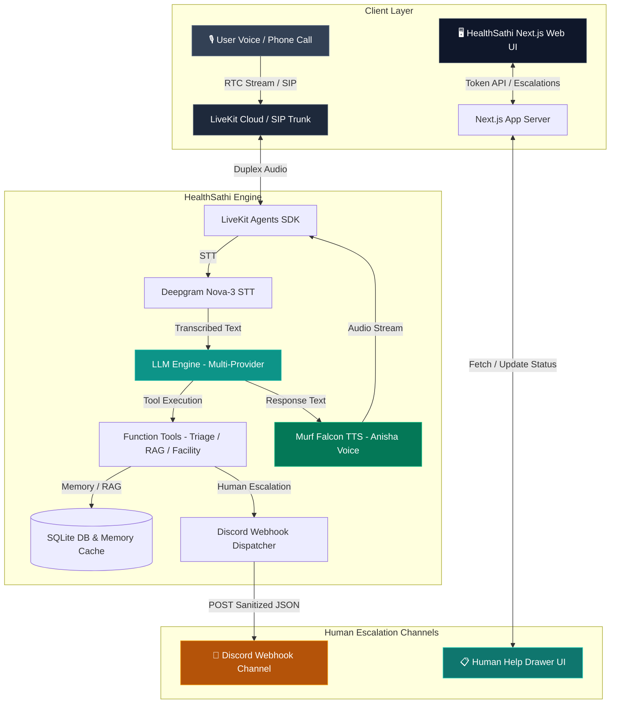

# HealthSathi — Voice-First AI Companion for Everyday Health Guidance

**HealthSathi** is a production-grade, real-time voice AI agent designed for the **Health Access** track. It helps users understand symptoms, perform safe symptom-to-triage classification, find nearby primary health centres and clinics, remember useful non-sensitive preferences, schedule health reminder calls, and connect with human healthcare support when necessary.

Powered by **LiveKit Agents SDK**, **Murf Falcon TTS** (Anisha voice), **Deepgram Nova-3 Multilingual STT**, and **Gemini / NVIDIA / Groq / OpenRouter LLMs**.

[](https://opensource.org/licenses/MIT) [](https://murf.ai/api/docs/text-to-speech/streaming) [](https://docs.livekit.io) [](https://www.typescriptlang.org/) [](https://www.python.org/)

---

> [!IMPORTANT]
> **Health Safety Boundary**: HealthSathi is NOT a doctor, diagnostic system, or emergency medical provider. It never diagnoses diseases, prescribes medication, or replaces professional medical care. For medical emergencies, users are directed to call **112** or visit a hospital immediately.

---

## 🌟 Key Features & Capabilities

- 🎙️ **Real-Time Duplex Audio Streaming**: Instant voice-to-voice interaction using Murf Falcon TTS (Anisha voice) and Deepgram Nova-3 Multilingual STT (supporting English, Hindi, and Hinglish).
- 🏥 **Safe Symptom Triage Classifier**: `symptom_to_triage` classifies reported symptoms into safe urgency levels (`self_care`, `routine`, `soon`, `urgent`) without diagnosing conditions or prescribing treatments.
- 📍 **Healthcare Facility Lookup**: `find_nearby_facility` recommends appropriate local facilities (health posts, PHCs, general clinics, or hospital emergency departments) based on urgency and location.
- 🧠 **Persistent User Memory & Context**: SQLite disk-backed memory (`healthsathi_memory.db`) storing user names, language preferences, reminder preferences, and contact preferences with explicit consent.
- 📚 **RAG & Health Knowledge Resources**: Knowledge engine (`search_health_resources`) retrieving verified guidance on symptom basics, doctor visit prep, and emergency warning signs.
- 📞 **Outbound Telephony & Health Reminders**: Scheduled automated health reminder and follow-up calls to user phone numbers via LiveKit SIP trunk.
- 🚨 **Human Escalation & Discord Delivery**: Detects red-flag emergency symptoms or explicit requests for human support, asks consent, scrubs PII, dispatches real-time alerts to a **Discord Webhook channel**, and tracks tickets in the frontend UI.

---

## 🏗 System Architecture



---

## 🗓 8 Days Progress (#VoiceForBharat Health Access Challenge)

| Day | Focus Area | Key Deliverables & Implementation |
| :---: | :--- | :--- |
| **[Day 1](./day_1/README.md)** | Basic Voice Agent Pipeline | Real-time duplex audio streaming using LiveKit Agents, Deepgram Nova-3 STT, Murf Falcon TTS (Anisha voice), and initial HealthSathi identity. |
| **[Day 2](./day_2/README.md)** | Personality & Safety Guardrails | HealthSathi companion persona, non-diagnostic safety guardrails, 1-question-at-a-time flow, and Hinglish support. |
| **[Day 3](./day_3/README.md)** | Voice UI & Web Interface | Healthcare teal visual theme (`#F0FAFA`, `#14B8A6`), quick action cards, non-medical disclaimer banner, and state orb visualizer (Ready, Connecting, Listening, Thinking, Speaking). |
| **[Day 4](./day_4/README.md)** | Persistent Memory & Privacy | SQLite user memory (`healthsathi_memory.db`), consent-based saving, verbal confirmation before memory deletion, and non-sensitive preference storage. |
| **[Day 5](./day_5/README.md)** | Health Tools & Triage | Function tools (`symptom_to_triage`, `find_nearby_facility`, `search_health_resources`), safe 4-level triage, facility type recommendation, and zero diagnostic claim rule. |
| **[Day 6](./day_6/README.md)** | Outbound Calls & Reminders | Scheduled health reminder calls via LiveKit SIP trunk, clear 3-part call opening, immediate stop request handling, and call outcome logging. |
| **[Day 7](./day_7/README.md)** | Human Escalation & Discord Channel | Emergency red-flag and explicit support request triggers, 7-step consent protocol, PII scrubbing (`_redact_pii`), reference ID generation (`ESC-XXXX`), and Discord webhook integration. |
| **[Day 8](./day_8/README.md)** | Call Analytics Dashboard & Outcomes | Call Analytics Drawer UI, SQLite metrics persistence (`call_analytics`), outcome classification (`GENERAL_GUIDANCE`, `TRIAGE_COMPLETED`, `FACILITY_FOUND`, `HUMAN_ESCALATION`, `INCOMPLETE`, `TECHNICAL_ERROR`), KPI summary cards, time filtering, and Zero-PII safeguard. |

---

## 📊 Day 8 Feature Spotlight: Call Analytics Dashboard & Outcome Tracking

HealthSathi provides comprehensive visibility into health access voice sessions with privacy-by-design monitoring:

### 1. Analytics & Outcome Tracking Schema
- Stores call duration, channel (`Browser` vs `SIP`), outcome status (`Successful` vs `Failed`), and specific resolution type (`GENERAL_GUIDANCE`, `TRIAGE_COMPLETED`, `FACILITY_FOUND`, `HUMAN_ESCALATION`, `INCOMPLETE`, `TECHNICAL_ERROR`).
- **Zero-Medical-PII Policy**: No medical symptoms, diagnoses, prescriptions, transcripts, or personal identifying info are ever stored in metrics.

### 2. Monitoring Dashboard UI
- Interactive drawer featuring real-time KPI summary cards (Total Calls, Successful Calls, Failed Calls, Success Rate %).
- Visual outcome breakdown progress bars, period filtering (`Today`, `Last 7 Days`, `All Time`), live refresh, and recent call log.

---

## 🧪 Testing

Run the automated test suite:

```bash
cd backend
uv run ruff check .
uv run pytest
uv run python verify_day8_demo.py
```

The test suite includes automated unit and integration tests covering memory consent, symptom triage, facility lookup, PII scrubbing, escalation workflow, analytics metrics, and multilingual voice capabilities.
